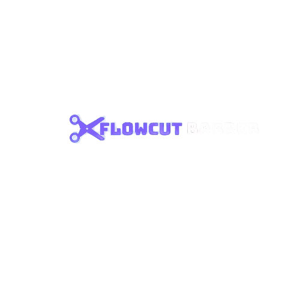

<p align="center">
  
</p>

<h1 align="center">FlowCut Barber</h1>

<p align="center">
  Aplicativo mobile para agendamento de serviços em barbearias, construído com <a href="https://expo.dev">Expo</a> e React Native.
</p>

## Sobre o projeto

O **FlowCut Barber** é um app mobile (Android, iOS e Web) que conecta clientes a barbearias, permitindo buscar estabelecimentos, visualizar serviços e horários disponíveis, e agendar cortes e outros serviços diretamente pelo celular.

### Principais funcionalidades

- 🔐 Autenticação de usuário (login e cadastro)
- 💈 Listagem e busca de barbearias
- 🗓️ Agendamento de horários com seleção de serviços
- 📖 Histórico de agendamentos do cliente
- 👤 Perfil do usuário, com edição de dados e foto

## Tecnologias

- [Expo](https://expo.dev) / [React Native](https://reactnative.dev)
- [Expo Router](https://docs.expo.dev/router/introduction/) (roteamento por arquivos)
- [TypeScript](https://www.typescriptlang.org/)
- [NativeWind](https://www.nativewind.dev/) (Tailwind CSS para React Native)
- [React Navigation](https://reactnavigation.org/)
- [React Native Reanimated](https://docs.swmansion.com/react-native-reanimated/) & [Gesture Handler](https://docs.swmansion.com/react-native-gesture-handler/)
- [React Native Calendars](https://github.com/wix/react-native-calendars)
- [date-fns](https://date-fns.org/)

## Estrutura do projeto

```
app/                # Rotas (Expo Router)
  (tabs)/            # Navegação por abas: home, barbearias, agendamentos, perfil
  barbershop/         # Detalhes e agendamento de uma barbearia específica
  appointments/        # Histórico de agendamentos
api/                # Chamadas HTTP para o backend
components/          # Componentes reutilizáveis de UI
contexts/            # Contextos globais (autenticação, data selecionada)
config/entities/      # Tipos de domínio (usuário, barbearia, agendamento, pagamento...)
```

## Como rodar o projeto

1. Instale as dependências

   ```bash
   yarn install
   ```

2. Inicie o app

   ```bash
   yarn start
   ```

No terminal, você poderá abrir o app em:

- [development build](https://docs.expo.dev/develop/development-builds/introduction/)
- Emulador Android (`yarn android`)
- Simulador iOS (`yarn ios`)
- Navegador (`yarn web`)
- [Expo Go](https://expo.dev/go)

> O app consome uma API própria (ver `api/baseFetch.ts`); certifique-se de que o backend esteja rodando e acessível no endereço configurado.

## Scripts disponíveis

| Comando               | Descrição                          |
| ---------------------- | ----------------------------------- |
| `yarn start`            | Inicia o Metro bundler / Expo       |
| `yarn android`          | Roda o app em um emulador/dispositivo Android |
| `yarn ios`              | Roda o app em um simulador/dispositivo iOS |
| `yarn web`              | Roda o app no navegador             |
| `yarn lint`             | Executa o linter (ESLint)           |
| `yarn reset-project`    | Reseta o projeto para um estado inicial em branco |

## Saiba mais

- [Documentação do Expo](https://docs.expo.dev/)
- [Documentação do Expo Router](https://docs.expo.dev/router/introduction/)
- [Documentação do NativeWind](https://www.nativewind.dev/)
